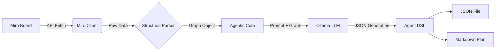

# 🚀 Miro Board to Agent DSL

**Turn your visual Miro workflows into executable Agentic AI plans.**

This project is an intelligent **Agentic AI Builder** that bridges the gap between visual design and technical implementation. It ingests a structured **Miro board**—containing frames, shapes, and connections—and converts it into a formal **Agent Build DSL (JSON)** and a **Structured Implementation Plan (Markdown)**.

It is designed to work with **Multi-Agent Systems**, allowing you to visually architect complex agent swarms and instantly generate the configuration code needed to build them.

---

## ✨ Features

- **🎨 Visual-to-Code**: Parse Miro boards to understand agent roles, workflows, and tools.
- **🤖 Multi-Agent Support**: Automatically distinguishes between **Sub-Agents** (orchestrators, researchers) and **Tools** (functions).
- **🧠 Local LLM Integration**: Uses **Ollama** (e.g., Qwen, Llama 3) for privacy-first, cost-effective processing.
- **📄 Dual Output**:
  - **JSON DSL**: Machine-readable schema for direct integration with agent frameworks (LangChain, AutoGen, etc.).
  - **Markdown Plan**: Human-readable documentation of the agent's architecture.
- **🔗 Structural Analysis**: Understands containment (items inside frames) and connectivity (arrows between steps).

---

## 🏗️ Architecture



---

## 🚀 Getting Started

### Prerequisites

- **Python 3.8+**
- **Miro Account** (and an API Access Token)
- **Ollama** installed and running locally

### Installation

1. **Clone the repository**:
   ```bash
   git clone https://github.com/fahadazizz/Miro-Board-Agent-Builder-Agentic-AI.git
   cd Miro-Board-Agent-Builder-Agentic-AI
   ```

2. **Install dependencies**:
   ```bash
   pip install requests pydantic langgraph langchain-community
   ```

### Configuration

1. **Set up Environment Variables**:
   You can set these in your shell or update `src/config.py`.

   ```bash
   export MIRO_ACCESS_TOKEN="your_miro_access_token"
   export OLLAMA_BASE_URL="http://localhost:11434"
   export OLLAMA_MODEL="qwen3-coder:480b-cloud" # Or any model you have pulled
   
   # Optional: LangSmith Observability
   export LANGCHAIN_TRACING_V2="true"
   export LANGCHAIN_API_KEY="your_langsmith_api_key"
   export LANGCHAIN_PROJECT="miro-agent-builder"
   ```

2. **Ensure Ollama is running**:
   ```bash
   ollama serve
   ```

---

## 💻 Usage

Run the agent by providing the URL of your Miro board:

```bash
python3 src/server.py "https://miro.com/app/board/uXjVO7_..."
```

### Options
- `--output`, `-o`: Specify the output filename (default: `agent_plan.json`).

---

## 📦 Output Formats

### 1. Agent DSL (`agent_plan.json`)
A formal JSON specification ideal for config-driven agent frameworks.

```json
{
  "name": "ResearchSystem",
  "type": "orchestrator",
  "sub_agents": [
    {
      "name": "Researcher",
      "role": "Information Gathering",
      "goal": "Find relevant papers"
    }
  ],
  "workflows": [
    {
      "name": "ResearchFlow",
      "steps": [
        {
          "step_id": 1,
          "description": "Search for papers",
          "assigned_to": "Researcher",
          "tools_required": ["web_search"]
        }
      ]
    }
  ]
}
```

### 2. Implementation Plan (`agent_plan.md`)
A clean, readable document describing the system.

```markdown
# Agent System: ResearchSystem
**Role:** Orchestrator
**Type:** orchestrator

## Sub-Agents
### Researcher
- **Role:** Information Gathering
- **Goal:** Find relevant papers

## Workflows
### ResearchFlow
**Steps:**
1. **[Researcher]** Search for papers (Tools: web_search)
```

---

## 📂 Project Structure

```
miro_agent/
├── src/
│   ├── agent.py        # LangGraph workflow & LLM logic
│   ├── config.py       # Configuration & Env vars
│   ├── miro_client.py  # Miro API interaction
│   ├── models.py       # Pydantic data models
│   ├── parser.py       # Structural graph analysis
│   └── server.py       # CLI Entry point
├── tests/              # Unit tests
├── agent_plan.json     # Generated Output
└── README.md           # Documentation
```

---

## 🤝 Contributing

Contributions are welcome! Please feel free to submit a Pull Request.
